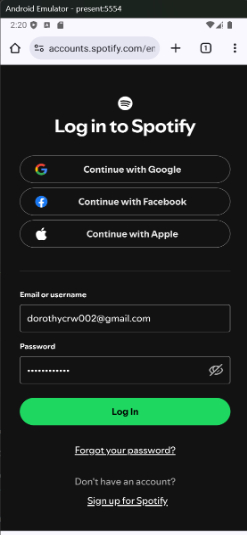
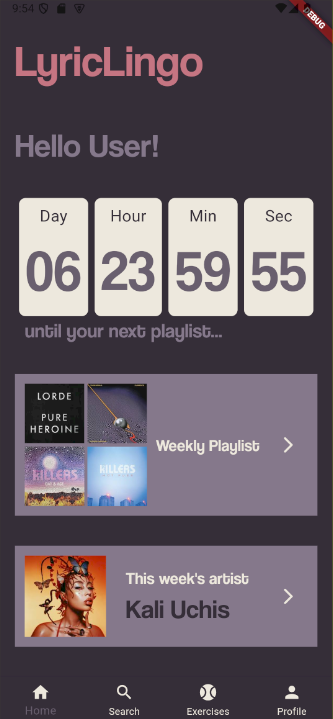
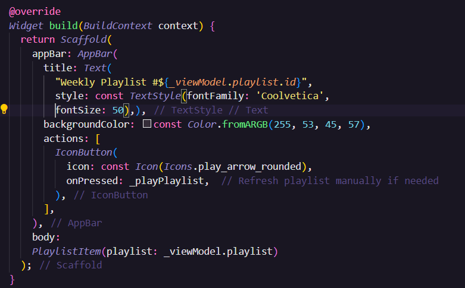

# Dev 3
## Group 1
- Raquel Buege
- Anna Plazek
- Dorothy Crow

## Overview
While our progress may seem minimal in terms of our current output and our previously defined final goals, our team has been hard at work overcoming many initial stumbling points and roadblocks early on in our development process. To date, our team has been able to accomplish both Spotify authentication as well as a fleshed-out homepage view with a fully functional bottom navigation bar.

We believe that now that our backend connection to Spotify is finally configured, our process will be more linear from this point onwards. That being said, after talking with Professor Biehl, we realized that our original key tasks (curated playlists, weekly artist highlight, karaoke learning exercise, fill-in-the-blank exercise, as well as lyric dissection) were perhaps too ambitious for our timeframe.

While we are going to continue working our hardest, we have decided as a team that the cultural immersion part of our app is the element we are most passionate about and the aspect that sets our app apart from other learning apps. Thus, our main focus will be the completion of the curated weekly playlist as well as the artist highlight. Only once those tasks are completed will we try to incorporate the learning exercises.

## Tasks Completed
### Spotify Authentication
The Spotify authentication turned out to be a much more complicated process than we originally planned. One key factor in our confusion is the many forms the Spotify package we were trying to use comes in. We originally planned on using the Spotify Sdk 3.0.2 package explicitly made for Flutter. We wanted to utilize this version because it seemed the most in touch with the language and architecture we were building in.

However, following the Flutter Spotify Sdk instruction you can very easily be set off course. The first thing you are instructed to do is make an account on the Spotify developer website. This is where you obtain your:

- Client ID
- Client Secret
- URI specification

These elements are all essential for making requests. However, immediately attached to the developer website are instructions for setting up the Spotify Android Sdk. Because we are still new to working with Flutter and especially Android, we didn't immediately realize the difference so we began to follow those instructions because of the official location.
The android instructions were very confusing for us because while seeming easy at first they quickly became us having to adjust native Android files like the AndriodManifest.xml and MainActivity.kt. This was where a big time suck happened because we have never done anything remotely similar to this and Kotlin was never mentioned in demos in class (we thought that was because the demos in class were done in IOS).

Despite feeling lost we persevered, watching many videos, and looking many things up online until we finally were able to have the first task of the app route to the Spotify login page, allow users to log in, and then redirect to our homepage. As we mentioned before this may not seem like a huge step but the process for getting it to work was very exhaustive.
Also although Dev 3 says that "extensive back-end supporting software and/or web services" is not required or expected, it is essential for creating our main key tasks. During this process of learning through experience we also realized the Spotify package, while coming in many forms, also has different functionality based on its form. For example, the Spotify Web API has additional abilities to request user information which is essential to our app's key tasks.

### Navigation
The bottom navigation bar is fully functional with users being able to click and be directed to four different pages:
- homepage
- search
- exercises
- profile
  
While these pages are not fully fleshed out, the beginning of their foundations are beginning to appear in terms of layout.

### Home Page View
While the homepage view is not a task per se, it is the heart of our application. When the user opens the app and is logged in, they will be met with the LyricLingo homepage. This view displays:

- Welcome message with the user's username
- Countdown until their next curated playlist drops
- Containers directing users to weekly playlist and weekly artist
- Bottom navigation bar for search page, exercises tab, and profile

After exactly a week passes, a new playlist of recommendations will drop and the timer will be reset. Our team still has to work out how we want to handle data storage across user sessions as the timer currently resets each time the app is reloaded.

### Weekly Playlist
Our initial troubles with the Spotify API blocked our progress on the majority of our key tasks, especially our curated playlist feature. Now that we have resolved those issues, the view frameworks developed to display that information fetched from Spotify can now be incorporated into our app.
When the user clicks on the arrow icon in the weekly playlist container on the homepage, the above view should be returned. This view will feature:

- Appbar with a title tracking the number of playlists generated
- Playlist data gathered from Spotify displayed in the PlaylistItem widget

While this view is not yet incorporated into our app, the framework exists that should make the integration process relatively simple. A challenge has presented itself in order to populate the playlists due to the need for an access token to retrieve user information.
We have mapped out the framework for the interface and how we will generate these playlists based on the user's information once we successfully retrieve and save the access token. We will be using an API call as noted on the Spotify documentation website that retrieves the user's top tracks. From this point forward, we will:

- Pull the relevant characteristics from each track
- Search for another track with that same information but in another language
- Create 1:1 mappings with the tracks that the user is currently enjoying

